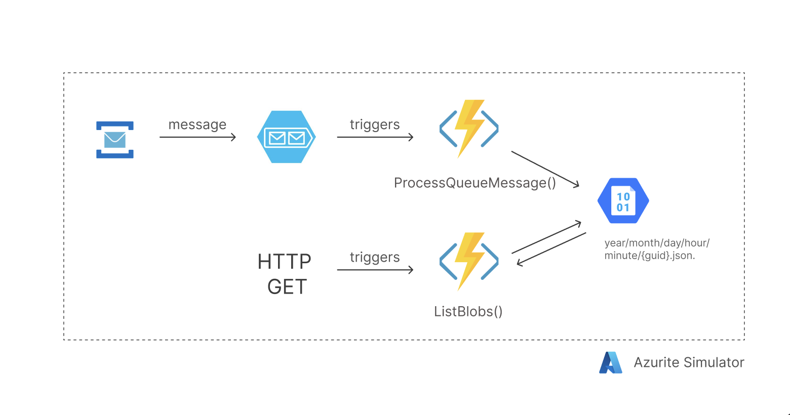
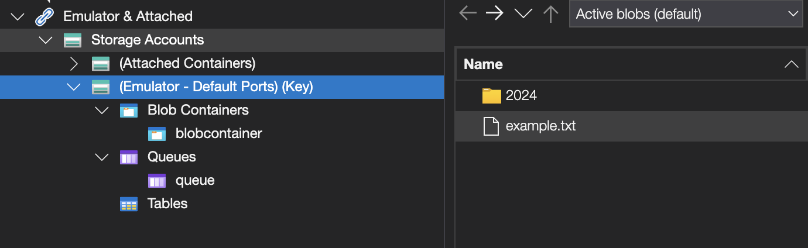

__________

Solution Diagram:




1. API - Containts triggers and create simulator BlobStorage & Queue
2. Azure Functions - Contains 2 Azure Functions (ProcessQueueMessage, ListBlobs)

_____

1. Azure Storage Explorer

Running Azurite:

```
dotnet add package Microsoft.Azure.Storage.Blob
dotnet add package Microsoft.Azure.Storage.Queue
dotnet add package Microsoft.Azure.WebJobs
dotnet add package Microsoft.Azure.WebJobs.Host
dotnet add package Microsoft.Azure.WebJobs.Extensions.Http
```

```
npm install -g azurite
azurite --silent
```

Azurite Blob service is starting at http://127.0.0.1:10000
Azurite Queue service is starting at http://127.0.0.1:10001

alternatively running by docker:

```
docker run -p 10000:10000 -p 10001:10001 mcr.microsoft.com/azure-storage/azurite
```


Tool for 

2. Azure Functions

How to initiate azure functions:

https://learn.microsoft.com/en-us/azure/azure-functions/functions-run-local?tabs=macos%2Cisolated-process%2Cnode-v4%2Cpython-v2%2Chttp-trigger%2Ccontainer-apps&pivots=programming-language-csharp

```
func init
func new
func start
```


Functions:

- ListBlobs: [GET,POST] http://localhost:7071/api/ListBlobs
- ProcessQueueMessage: queueTrigger

Testing:

Adding message to queue

- by API endpoint
- by Azure Storage Explorer

Listing all containers:
http://localhost:7071/api/ListBlobs?Name=blobcontainer